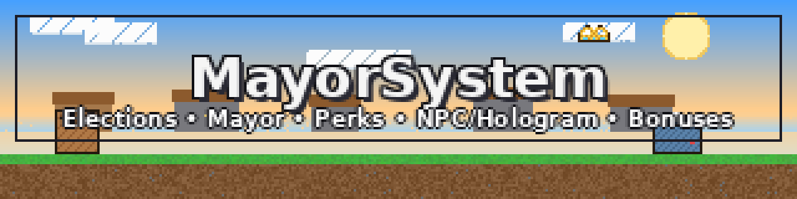
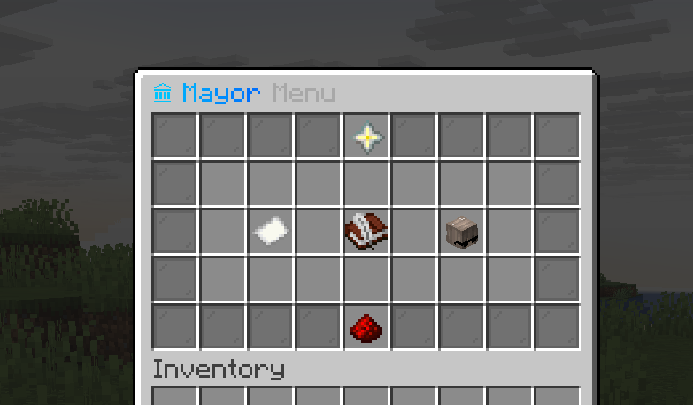
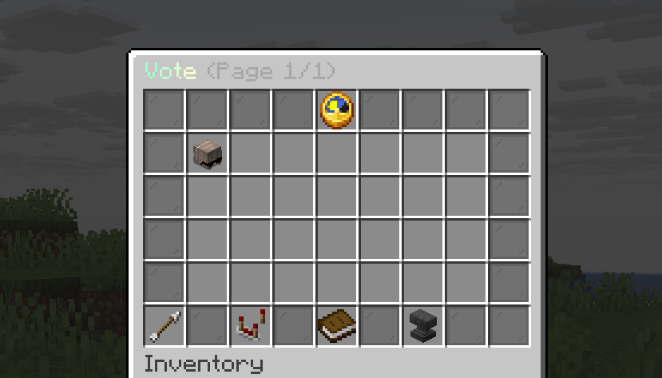
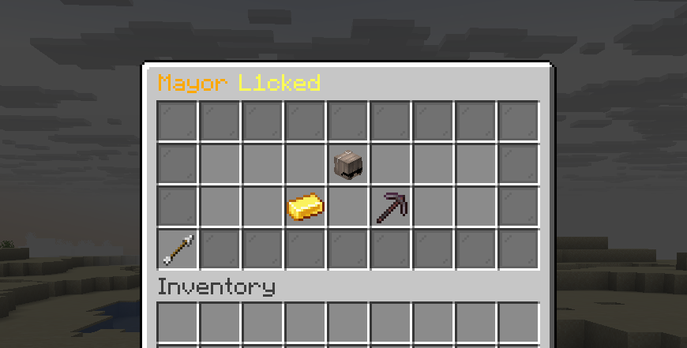
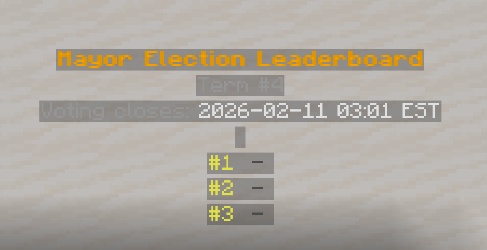
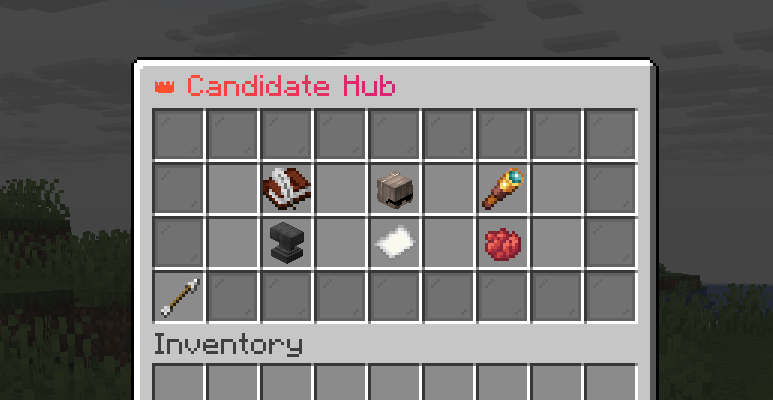
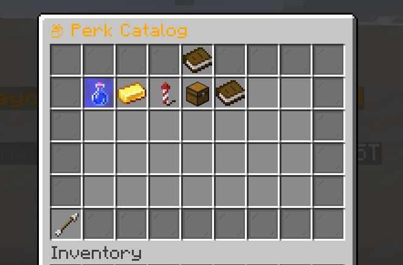
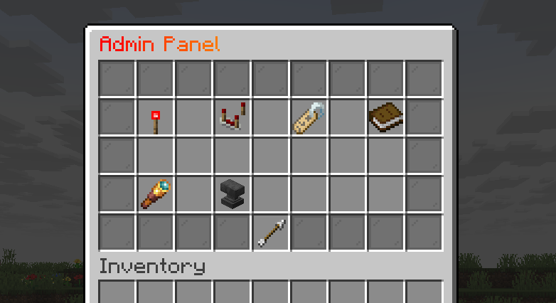
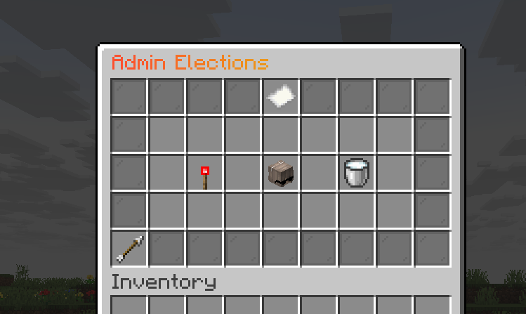
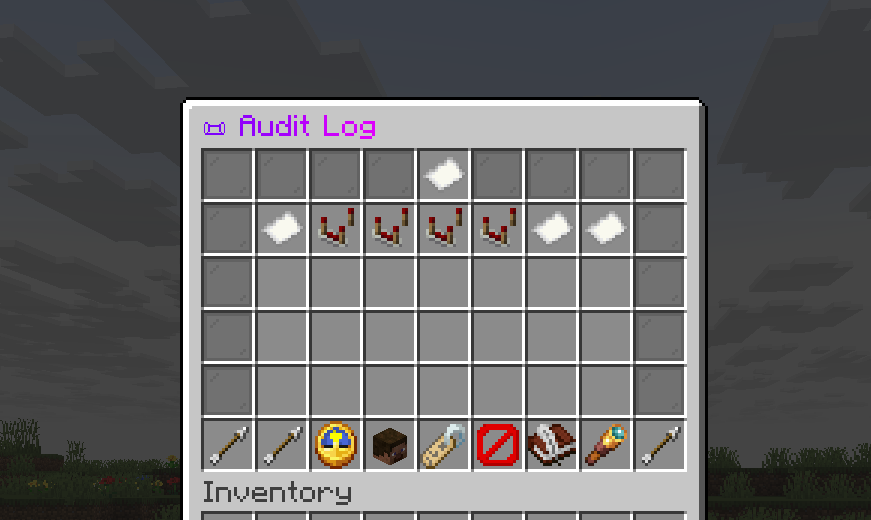

# MayorSystem

MayorSystem is a [Paper](https://papermc.io/) 1.21.8 plugin that runs server elections, crowns a mayor, and lets that mayor pick server-wide perks. It includes optional displays (NPC or hologram), sell bonuses, and full admin tooling.




**Version:** 1.0.0

> **MIT License**
> This project is licensed under the MIT License.
> See `LICENSE` for full terms.

---

## At a Glance
- Scheduled terms with a configurable vote window (ISO-8601 durations)
- Candidate applications with playtime and cost requirements
- Perk catalog with sections, pick limits, and custom perk requests
- Bonus terms every N terms
- Public toggle and pause modes to selectively freeze systems
- Sell bonuses ([SystemSellAddon](https://github.com/L1cked/SystemSellAddon) integration)
- Skyblock-style perk mechanics via [SystemSkyblockStyleAddon](https://github.com/L1cked/SystemSkyblockStyleAddon) (optional)
- Mayor NPC statue and optional leaderboard hologram ([DecentHolograms](https://github.com/DecentSoftware-eu/DecentHolograms))
- Admin menus, audit log, health checks, and force-election tools
- MiniMessage formatting with optional [PlaceholderAPI](https://github.com/PlaceholderAPI/PlaceholderAPI)

---

## Screenshots



















---

## How Elections Work (30-second overview)
- Terms run on a schedule starting at `term.first_term_start`.
- The vote window opens `term.vote_window` before a term starts.
- Players apply to be candidates if they meet playtime and cost requirements.
- Players vote, a mayor is elected, and the mayor picks perks for the term.
- Bonus terms can grant extra perks every N terms.

---

## Display: Mayor NPC + Leaderboard Hologram
MayorSystem supports two optional displays that can be used together or in rotation.

### Mayor NPC ([Citizens](https://github.com/CitizensDev/Citizens2) or [FancyNpcs](https://github.com/FancyMcPlugins/FancyNpcs))
- Spawn/move: `/%title_command% admin npc spawn` (fallback: `/mayor admin npc spawn`)
- Remove: `/%title_command% admin npc remove` (fallback: `/mayor admin npc remove`)
- Force update: `/%title_command% admin npc update` (fallback: `/mayor admin npc update`)

### Leaderboard Hologram ([DecentHolograms](https://github.com/DecentSoftware-eu/DecentHolograms))
- Spawn/move: `/%title_command% admin hologram spawn` (fallback: `/mayor admin hologram spawn`)
- Remove: `/%title_command% admin hologram remove` (fallback: `/mayor admin hologram remove`)
- Force update: `/%title_command% admin hologram update` (fallback: `/mayor admin hologram update`)

### Showcase Mode
Set how displays behave in `config.yml`:
- `showcase.mode: SWITCHING` will show the hologram during elections and the NPC once a mayor is elected.
- `showcase.mode: INDIVIDUAL` keeps each display active at its own location.

In SWITCHING mode, if no mayor is elected yet, the hologram stays active. The hologram uses the NPC location in this mode.

You can also switch mode in-game:
- `/%title_command% admin display mode <switching|individual>` (fallback: `/mayor admin display mode <switching|individual>`)

---

## [SystemSellAddon](https://github.com/L1cked/SystemSellAddon) Integration (Recommended)
[SystemSellAddon](https://github.com/L1cked/SystemSellAddon) applies MayorSystem sell bonuses directly to /sell payouts.
- Bonuses stack on top of [SystemSellAddon](https://github.com/L1cked/SystemSellAddon) payouts
- Category and total bonuses are passed through cleanly
- Bonus messages are pulled from `messages.yml` (key: `public.sell_bonus`)

On first start with [SystemSellAddon](https://github.com/L1cked/SystemSellAddon) installed, MayorSystem imports `mayor-perks` into
`perks.sections.economy` in its own `config.yml` so menus read from a single source.
Delete that section to re-sync from [SystemSellAddon](https://github.com/L1cked/SystemSellAddon).

---

## [SystemSkyblockStyleAddon](https://github.com/L1cked/SystemSkyblockStyleAddon) Integration
MayorSystem can drive the Skyblock-style perk mechanics provided by [SystemSkyblockStyleAddon](https://github.com/L1cked/SystemSkyblockStyleAddon) (also referred to as SystemSkyblockStyleSystem).
Enable the `skyblock_style` section in `config.yml`, elect a mayor, and the addon will apply mechanics for any active perks.

On first start with [SystemSkyblockStyleAddon](https://github.com/L1cked/SystemSkyblockStyleAddon) installed, MayorSystem imports perk display data into
`perks.sections.skyblock_style` in its own `config.yml` so menus read from a single source.
Delete that section to re-sync from the addon.

---

## Requirements
- [Paper](https://papermc.io/) 1.21.8 (API 1.21)
- [Java 21](https://adoptium.net/temurin/releases/?version=21)

---

## Quick Start
1. Drop the jar into `plugins/` and start the server once.
2. Open `plugins/MayorSystem/config.yml` and set `term.first_term_start` to a real future date/time.
   Example: `2026-03-01T00:00:00-05:00`
3. (Optional) Adjust `term.length`, `term.vote_window`, and `term.perks_per_term`.
4. (Optional) Install integrations ([Vault](https://github.com/MilkBowl/Vault) + a compatible economy plugin, [Citizens](https://github.com/CitizensDev/Citizens2)/[FancyNpcs](https://github.com/FancyMcPlugins/FancyNpcs), [SystemSellAddon](https://github.com/L1cked/SystemSellAddon), [SystemSkyblockStyleAddon](https://github.com/L1cked/SystemSkyblockStyleAddon), [PlaceholderAPI](https://github.com/PlaceholderAPI/PlaceholderAPI), [DecentHolograms](https://github.com/DecentSoftware-eu/DecentHolograms)).
5. Join in-game and run `/%title_command%` (fallback: `/mayor`).

If you install [SystemSellAddon](https://github.com/L1cked/SystemSellAddon) or [SystemSkyblockStyleAddon](https://github.com/L1cked/SystemSkyblockStyleAddon), MayorSystem will import those perk definitions
into `plugins/MayorSystem/config.yml` on first start. Edit them there afterward, or delete the section to re-sync.

Tip: The default `term.first_term_start` is set far in the future so nothing starts until you set it.

---

## Commands

### Public / Player
```
/%title_command%   # fallback: /mayor
/%title_command% status   # fallback: /mayor status
/%title_command% apply   # fallback: /mayor apply
/%title_command% vote <candidate>   # fallback: /mayor vote <candidate>
/%title_command% vote   # fallback: /mayor vote; opens the vote menu
/%title_command% candidate   # fallback: /mayor candidate
/%title_command% stepdown   # fallback: /mayor stepdown
```

### Admin: Core
```
/%title_command% admin   # fallback: /mayor admin
/%title_command% admin open <menuId>   # fallback: /mayor admin open <menuId>
/%title_command% admin system   # fallback: /mayor admin system
/%title_command% admin system toggle   # fallback: /mayor admin system toggle
/%title_command% admin system refresh_offline_cache   # fallback: /mayor admin system refresh_offline_cache
```

### Admin: Display
```
/%title_command% admin display   # fallback: /mayor admin display
/%title_command% admin display mode <switching|individual>   # fallback: /mayor admin display mode <switching|individual>
```

### Admin: NPC
```
/%title_command% admin npc spawn   # fallback: /mayor admin npc spawn
/%title_command% admin npc remove   # fallback: /mayor admin npc remove
/%title_command% admin npc update   # fallback: /mayor admin npc update
```

### Admin: Hologram ([DecentHolograms](https://github.com/DecentSoftware-eu/DecentHolograms))
```
/%title_command% admin hologram spawn   # fallback: /mayor admin hologram spawn
/%title_command% admin hologram remove   # fallback: /mayor admin hologram remove
/%title_command% admin hologram update   # fallback: /mayor admin hologram update
```

### Admin: Governance
```
/%title_command% admin governance   # fallback: /mayor admin governance
```

### Admin: Messaging
```
/%title_command% admin messaging   # fallback: /mayor admin messaging
```

### Admin: Monitoring
```
/%title_command% admin monitoring   # fallback: /mayor admin monitoring
/%title_command% admin audit   # fallback: /mayor admin audit
/%title_command% admin health   # fallback: /mayor admin health
```

### Admin: Maintenance
```
/%title_command% admin maintenance   # fallback: /mayor admin maintenance
/%title_command% admin debug   # fallback: /mayor admin debug
/%title_command% admin reload   # fallback: /mayor admin reload
/%title_command% admin settings reload   # fallback: /mayor admin settings reload
```

### Admin: Candidates
```
/%title_command% admin candidates   # fallback: /mayor admin candidates
/%title_command% admin candidates remove <player>   # fallback: /mayor admin candidates remove <player>
/%title_command% admin candidates restore <player>   # fallback: /mayor admin candidates restore <player>
/%title_command% admin candidates process <player>   # fallback: /mayor admin candidates process <player>
/%title_command% admin candidates applyban perm <player>   # fallback: /mayor admin candidates applyban perm <player>
/%title_command% admin candidates applyban temp <player> <days>   # fallback: /mayor admin candidates applyban temp <player> <days>
/%title_command% admin candidates applyban clear <player>   # fallback: /mayor admin candidates applyban clear <player>
```

### Admin: Perks
```
/%title_command% admin perks   # fallback: /mayor admin perks
/%title_command% admin perks refresh   # fallback: /mayor admin perks refresh
/%title_command% admin perks refresh <player|--all|all>   # fallback: /mayor admin perks refresh <player|--all|all>
/%title_command% admin perks requests   # fallback: /mayor admin perks requests
/%title_command% admin perks requests approve <id>   # fallback: /mayor admin perks requests approve <id>
/%title_command% admin perks requests deny <id>   # fallback: /mayor admin perks requests deny <id>
/%title_command% admin customperk <id> <approve|deny>   # fallback: /mayor admin customperk <id> <approve|deny>
/%title_command% admin perks catalog   # fallback: /mayor admin perks catalog
/%title_command% admin perks catalog section <section> <toggle|on|off>   # fallback: /mayor admin perks catalog section <section> <toggle|on|off>
/%title_command% admin perks catalog perk <section> <perk> <toggle|on|off>   # fallback: /mayor admin perks catalog perk <section> <perk> <toggle|on|off>
```

### Admin: Election
```
/%title_command% admin election   # fallback: /mayor admin election
/%title_command% admin election start   # fallback: /mayor admin election start
/%title_command% admin election end   # fallback: /mayor admin election end
/%title_command% admin election clear   # fallback: /mayor admin election clear
/%title_command% admin election elect   # fallback: /mayor admin election elect
/%title_command% admin election elect set <player>   # fallback: /mayor admin election elect set <player>
/%title_command% admin election elect clear   # fallback: /mayor admin election elect clear
/%title_command% admin election elect now <player>   # fallback: /mayor admin election elect now <player>
```

### Admin: Settings (menu shortcuts)
```
/%title_command% admin settings   # fallback: /mayor admin settings
/%title_command% admin settings enabled   # fallback: /mayor admin settings enabled
/%title_command% admin settings public_enabled   # fallback: /mayor admin settings public_enabled
/%title_command% admin settings pause_enabled   # fallback: /mayor admin settings pause_enabled
/%title_command% admin settings mayor_group   # fallback: /mayor admin settings mayor_group
/%title_command% admin settings enable_options   # fallback: /mayor admin settings enable_options
/%title_command% admin settings pause_options   # fallback: /mayor admin settings pause_options
/%title_command% admin settings display   # fallback: /mayor admin settings display
/%title_command% admin settings term_length   # fallback: /mayor admin settings term_length
/%title_command% admin settings vote_window   # fallback: /mayor admin settings vote_window
/%title_command% admin settings first_term_start   # fallback: /mayor admin settings first_term_start
/%title_command% admin settings perks_per_term   # fallback: /mayor admin settings perks_per_term
/%title_command% admin settings term_extras   # fallback: /mayor admin settings term_extras
/%title_command% admin settings bonus_enabled   # fallback: /mayor admin settings bonus_enabled
/%title_command% admin settings bonus_every   # fallback: /mayor admin settings bonus_every
/%title_command% admin settings bonus_perks   # fallback: /mayor admin settings bonus_perks
/%title_command% admin settings playtime_minutes   # fallback: /mayor admin settings playtime_minutes
/%title_command% admin settings apply_cost   # fallback: /mayor admin settings apply_cost
/%title_command% admin settings custom_limit   # fallback: /mayor admin settings custom_limit
/%title_command% admin settings custom_condition   # fallback: /mayor admin settings custom_condition
/%title_command% admin settings chat_prompts   # fallback: /mayor admin settings chat_prompts
/%title_command% admin settings broadcasts   # fallback: /mayor admin settings broadcasts
```

### Admin: Settings (direct commands)
```
/%title_command% admin settings enabled <true|false>   # fallback: /mayor admin settings enabled <true|false>
/%title_command% admin settings public_enabled <true|false>   # fallback: /mayor admin settings public_enabled <true|false>
/%title_command% admin settings pause_enabled <true|false>   # fallback: /mayor admin settings pause_enabled <true|false>
/%title_command% admin settings mayor_group_enabled <true|false>   # fallback: /mayor admin settings mayor_group_enabled <true|false>
/%title_command% admin settings mayor_group <group>   # fallback: /mayor admin settings mayor_group <group>
/%title_command% admin settings enable_options <option>   # fallback: /mayor admin settings enable_options <option>
/%title_command% admin settings pause_options <option>   # fallback: /mayor admin settings pause_options <option>
/%title_command% admin settings term_length <ISO-8601 duration>   # fallback: /mayor admin settings term_length <ISO-8601 duration>
/%title_command% admin settings vote_window <ISO-8601 duration>   # fallback: /mayor admin settings vote_window <ISO-8601 duration>
/%title_command% admin settings first_term_start <OffsetDateTime>   # fallback: /mayor admin settings first_term_start <OffsetDateTime>
/%title_command% admin settings perks_per_term <int>   # fallback: /mayor admin settings perks_per_term <int>
/%title_command% admin settings bonus_enabled <true|false>   # fallback: /mayor admin settings bonus_enabled <true|false>
/%title_command% admin settings bonus_every <int>   # fallback: /mayor admin settings bonus_every <int>
/%title_command% admin settings bonus_perks <int>   # fallback: /mayor admin settings bonus_perks <int>
/%title_command% admin settings playtime_minutes <int>   # fallback: /mayor admin settings playtime_minutes <int>
/%title_command% admin settings apply_cost <number>   # fallback: /mayor admin settings apply_cost <number>
/%title_command% admin settings custom_limit <int>   # fallback: /mayor admin settings custom_limit <int>
/%title_command% admin settings custom_condition <NONE|ELECTED_ONCE|APPLY_REQUIREMENTS>   # fallback: /mayor admin settings custom_condition <NONE|ELECTED_ONCE|APPLY_REQUIREMENTS>
/%title_command% admin settings chat_prompts <bio|title|description> <int>   # fallback: /mayor admin settings chat_prompts <bio|title|description> <int>
/%title_command% admin settings chat_prompt_timeout <int>   # fallback: /mayor admin settings chat_prompt_timeout <int>
/%title_command% admin settings allow_vote_change <true|false>   # fallback: /mayor admin settings allow_vote_change <true|false>
/%title_command% admin settings tie_policy <SEEDED_RANDOM|INCUMBENT|EARLIEST_APPLICATION|ALPHABETICAL>   # fallback: /mayor admin settings tie_policy <SEEDED_RANDOM|INCUMBENT|EARLIEST_APPLICATION|ALPHABETICAL>
/%title_command% admin settings mayor_stepdown <OFF|NO_MAYOR|KEEP_MAYOR>   # fallback: /mayor admin settings mayor_stepdown <OFF|NO_MAYOR|KEEP_MAYOR>
/%title_command% admin settings stepdown_reapply <true|false>   # fallback: /mayor admin settings stepdown_reapply <true|false>
/%title_command% admin settings reload   # fallback: /mayor admin settings reload
```

---

## Permissions

### Player
| Node | Default | Description |
| --- | --- | --- |
| `mayor.use` | true | Access the `/%title_command%` (fallback: `/mayor`) menu |
| `mayor.apply` | true | Apply to be a candidate |
| `mayor.vote` | true | Vote in elections |
| `mayor.candidate` | true | Candidate actions (perk selection, custom requests) |

### Admin
| Node | Default | Description |
| --- | --- | --- |
| `mayor.admin.access` | op | Root admin access (child of any admin node) |
| `mayor.admin.panel.open` | op | Open admin panel |
| `mayor.admin.system.toggle` | op | Toggle public access |
| `mayor.admin.candidates.remove` | op | Remove a candidate |
| `mayor.admin.candidates.restore` | op | Restore a candidate |
| `mayor.admin.candidates.process` | op | Mark candidate as in-process |
| `mayor.admin.candidates.applyban` | op | Manage apply bans |
| `mayor.admin.perks.refresh` | op | Refresh active perks |
| `mayor.admin.perks.requests` | op | Approve/deny custom perk requests |
| `mayor.admin.perks.catalog` | op | Enable/disable perk sections or perks |
| `mayor.admin.governance.edit` | op | Edit governance policies |
| `mayor.admin.messaging.edit` | op | Edit messaging settings |
| `mayor.admin.election.start` | op | Force-start election |
| `mayor.admin.election.end` | op | Force-end election |
| `mayor.admin.election.clear` | op | Clear term overrides |
| `mayor.admin.election.elect` | op | Force-elect a player |
| `mayor.admin.settings.edit` | op | Edit settings |
| `mayor.admin.settings.reload` | op | Reload config + store (legacy-compatible node) |
| `mayor.admin.maintenance.reload` | op | Reload config + store |
| `mayor.admin.maintenance.debug` | op | Access maintenance debug tools (offline cache, reset) |
| `mayor.admin.audit.view` | op | View audit log |
| `mayor.admin.health.view` | op | Run health checks |
| `mayor.admin.npc.mayor` | op | Spawn/remove/update Mayor NPC |
| `mayor.admin.hologram.leaderboard` | op | Spawn/remove/update leaderboard hologram |

---

## Menus (GUI)

### Public / Player
- MainMenu: entry point + quick status
- StatusMenu: term timeline + election window
- VoteMenu / VoteConfirmMenu: pick + confirm a vote
- CandidateMenu: candidate hub
- CandidatePerkCatalogMenu / CandidatePerkSectionMenu / CandidatePerksViewMenu
- CandidateCustomPerksMenu: request custom perks
- ApplySectionsMenu / ApplyPerksMenu / ApplyConfirmMenu
- StepDownConfirmMenu
- MayorProfileMenu (opened from the Mayor NPC)

### Admin
- AdminMenu: staff home
- AdminDebugMenu (reload, offline cache, reset)
- AdminMonitoringMenu / AdminAuditMenu / AdminHealthMenu
- AdminCandidatesMenu / ConfirmRemoveCandidateMenu
- AdminApplyBanSearchMenu / AdminApplyBanTypeMenu / AdminApplyBanDurationMenu
- AdminPerksMenu / AdminPerkCatalogMenu / AdminPerkSectionMenu / AdminPerkRequestsMenu / AdminPerkRefreshMenu
- AdminElectionMenu / AdminElectionSettingsMenu
- AdminForceElectMenu / AdminForceElectSectionsMenu / AdminForceElectPerksMenu / AdminForceElectConfirmMenu
- AdminSettingsMenu / AdminSettingsGeneralMenu / AdminSettingsEnableOptionsMenu / AdminSettingsPauseOptionsMenu
- AdminSettingsTermMenu / AdminBonusTermMenu / GovernanceSettingsMenu
- AdminSettingsApplyMenu / AdminSettingsCustomRequestsMenu / AdminSettingsChatPromptsMenu
- AdminMessagingMenu
- AdminDisplayMenu (NPC + hologram controls)
- AdminResetElectionConfirmMenu

### Admin menu IDs (for `/%title_command% admin open <menuId>`; fallback: `/mayor admin open <menuId>`)
```
ADMIN, SYSTEM, GOVERNANCE, ELECTION, ELECTION_SETTINGS, ELECTION_TERM, FORCE_ELECT,
CANDIDATES, APPLYBAN, PERKS, PERKS_CATALOG, PERK_REQUESTS, PERKS_REFRESH,
MESSAGING, MONITORING, MAINTENANCE,
SETTINGS, SETTINGS_GENERAL, SETTINGS_MAYOR_GROUP, SETTINGS_TERM, SETTINGS_TERM_EXTRAS, SETTINGS_APPLY,
SETTINGS_CUSTOM, SETTINGS_CHAT, SETTINGS_ELECTION, BONUS_TERM, AUDIT, HEALTH, DEBUG
```

---

## Configuration Highlights
- `enabled`: Master switch for the plugin.
- `public_enabled`: Toggle the system for regular players while keeping admin access.
- `title.name`: Role display name used across menus/messages (example: Mayor -> King).
- `title.command_alias_enabled`: Enables dynamic alias routing from `/<sanitized title.name>` to `/mayor`. Sanitization keeps lowercase `a-z` only and removes other characters.
- `title.player_prefix`, `title.chat_prefix`: MiniMessage templates with `%title_name%` / `%title_command%` tokens.
- `title.username_group_enabled`, `title.username_group`: Assign the elected player to a [LuckPerms](https://github.com/LuckPerms/LuckPerms) group that you manage in [LuckPerms](https://github.com/LuckPerms/LuckPerms) (permissions/meta/prefix). If missing, MayorSystem auto-creates the group.
- `enable_options`: Select which subsystems are affected when `enabled=false`.
- `pause.enabled`: Pause scheduling without disabling the plugin.
- `pause.options`: Select which subsystems are affected when paused.
- `term.length`, `term.vote_window`, `term.first_term_start`, `term.perks_per_term`: Core term settings.
- `term.bonus_term.*`: Bonus term settings.
- `apply.playtime_minutes`, `apply.cost`: Candidate requirements.
- `election.allow_vote_change`, `election.tie_policy`, `election.mayor_stepdown`, `election.stepdown.allow_reapply`.
- `sell_bonus.*`: Sell-bonus stacking rules (consumed by [SystemSellAddon](https://github.com/L1cked/SystemSellAddon)).
- `custom_requests.*`: Custom perk request limits and conditions.
- `perks.command_execution.enable_console_commands`: If false, non-effect perk commands are never dispatched from console.
- `perks.command_execution.allow_roots`: Allowlist for dangerous command roots that are blocked by default.
- `showcase.*`, `npc.*`, `hologram.*`: Display settings.
- `data.store.*`: SQLite or MySQL storage.

Subsystem options for `enable_options` and `pause.options`:
`SCHEDULE`, `ACTIONS`, `PERKS`, `MAYOR_NPC`, `BROADCASTS`.

---

## Configuration Examples
- [Example config.yml](docs/examples/config.yml)
- [Example messages.yml](docs/examples/messages.yml)

---

## Dependencies & Integrations

### Required
- [Paper](https://papermc.io/) 1.21.8 (API 1.21)
- [Java 21](https://adoptium.net/temurin/releases/?version=21)

### Optional (auto-detected)
- [Vault](https://github.com/MilkBowl/Vault) (economy bridge + optional NPC chat-prefix lookup)
- Vault-compatible economy plugin (economy provider, e.g., [EssentialsX Economy](https://github.com/EssentialsX/Essentials))
- [Citizens](https://github.com/CitizensDev/Citizens2) or [FancyNpcs](https://github.com/FancyMcPlugins/FancyNpcs) (Mayor NPC)
- [SystemSellAddon](https://github.com/L1cked/SystemSellAddon) (sell bonus integration)
- [SystemSkyblockStyleAddon](https://github.com/L1cked/SystemSkyblockStyleAddon) (Skyblock-style perk mechanics)
- [PlaceholderAPI](https://github.com/PlaceholderAPI/PlaceholderAPI) (placeholders in messages + broadcasts)
- [LuckPerms](https://github.com/LuckPerms/LuckPerms) (elected-player group integration)
- [DecentHolograms](https://github.com/DecentSoftware-eu/DecentHolograms) (leaderboard hologram)

---

## Data Storage
- `data.store.type = sqlite` or `mysql`
- SQLite file: `elections.db`
- MySQL settings live under `data.store.mysql` in `config.yml`

---

## [PlaceholderAPI](https://github.com/PlaceholderAPI/PlaceholderAPI)
If [PlaceholderAPI](https://github.com/PlaceholderAPI/PlaceholderAPI) is installed, MayorSystem registers these placeholders:
- `%mayorsystem_leaderboard_term%` -> current election term number (1-based)
- `%mayorsystem_leaderboard_<pos>_name%` -> candidate name at position `<pos>`
- `%mayorsystem_leaderboard_<pos>_votes%` -> vote count at position `<pos>`
- `%mayorsystem_leaderboard_<pos>_uuid%` -> candidate UUID at position `<pos>`

`<pos>` starts at 1. If there is no candidate at that position, the placeholder returns an empty string.

---

## Support & Troubleshooting
- Use `/%title_command% admin maintenance` (fallback: `/mayor admin maintenance`) or `/%title_command% admin debug` (fallback: `/mayor admin debug`) for maintenance tools.
- Reload requires `mayor.admin.maintenance.reload` (or `mayor.admin.settings.reload`).
- Offline cache refresh / reset election requires `mayor.admin.maintenance.debug`.
- Use `/%title_command% admin monitoring` (fallback: `/mayor admin monitoring`) or `/%title_command% admin health` (fallback: `/mayor admin health`) for a full environment check.
- Health includes [LuckPerms](https://github.com/LuckPerms/LuckPerms) integration checks: plugin enabled, API service available, configured group exists, and elected mayor group node state.
- Menu clicks are permission-revalidated; if a player's relevant perms change while a menu is open, actions are denied and the menu is closed.
- Use `/%title_command% admin audit` (fallback: `/mayor admin audit`) to see who changed what.
- Check `config.yml` and `messages.yml` for customization.
- Use `messages.yml -> styles.*` to retheme warning/error/success colors from one place.
- If NPCs or holograms do not show, confirm the integration plugin is installed and enabled, then run `/%title_command% admin health` (fallback: `/mayor admin health`).

---

## Build (for developers)
```
./gradlew clean jar
```
This produces the thin upload jar in `build/libs/` (no shaded dependencies).
Runtime dependencies are downloaded by [Paper](https://papermc.io/)/[Spigot](https://www.spigotmc.org/) from `plugin.yml -> libraries` at server startup.

Optional local fat jar (not for upload):
```
./gradlew shadowJar
```

---

## License
This project is licensed under the MIT License.

Copyright (c) 2026 Lou Morel (Canada)

See `LICENSE` for the full text.
