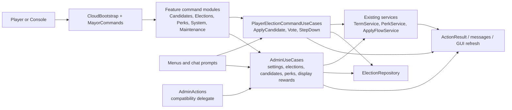

# Commands And Use-Cases

```mermaid
flowchart LR
    Player["Player or Console"]
    Cloud["CloudBootstrap + MayorCommands"]
    FeatureCommands["Feature command modules\nCandidates, Elections, Perks, System, Maintenance"]
    Menus["Menus and chat prompts"]
    PlayerCases["PlayerElectionCommandUseCases\nApplyCandidate, Vote, StepDown"]
    AdminCases["AdminUseCases\nsettings, elections, candidates, perks, display rewards"]
    Facade["AdminActions\ncompatibility delegate"]
    Services["Existing services\nTermService, PerkService, ApplyFlowService"]
    Repo["ElectionRepository"]
    Result["ActionResult / messages / GUI refresh"]

    Player --> Cloud
    Cloud --> FeatureCommands
    FeatureCommands --> PlayerCases
    FeatureCommands --> AdminCases
    Menus --> PlayerCases
    Menus --> AdminCases
    Facade --> AdminCases
    PlayerCases --> Services
    AdminCases --> Services
    AdminCases --> Repo
    PlayerCases --> Repo
    Services --> Result
    AdminCases --> Result
    PlayerCases --> Result
```

Commands and GUIs should parse input, enforce permissions, call a use-case or service, then render the result.
