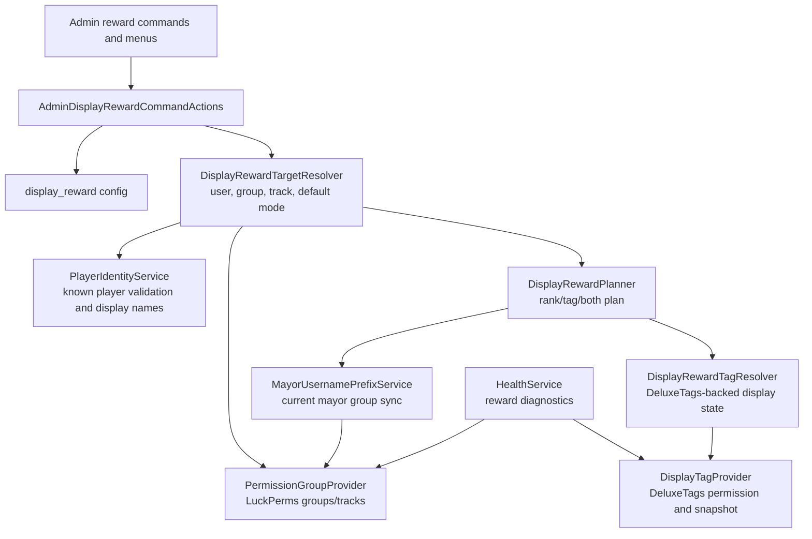

# Display Rewards

Rank rewards grant the configured LuckPerms group. Tag rewards grant the configured DeluxeTags permission through LuckPerms. User target lookup accepts UUIDs, online names, cached known names, and previously joined Bukkit profiles.
