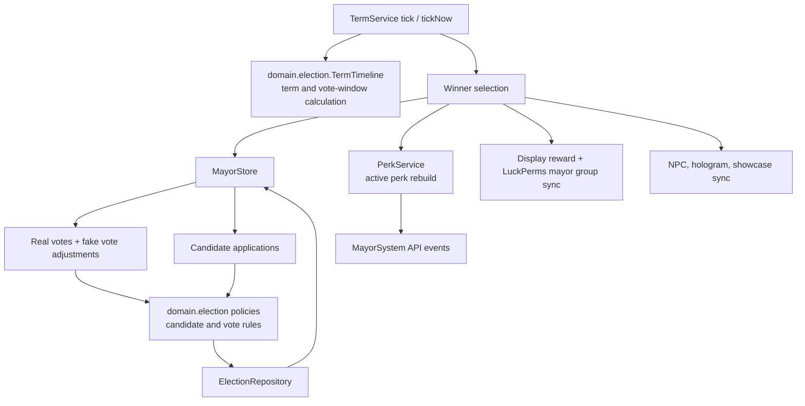
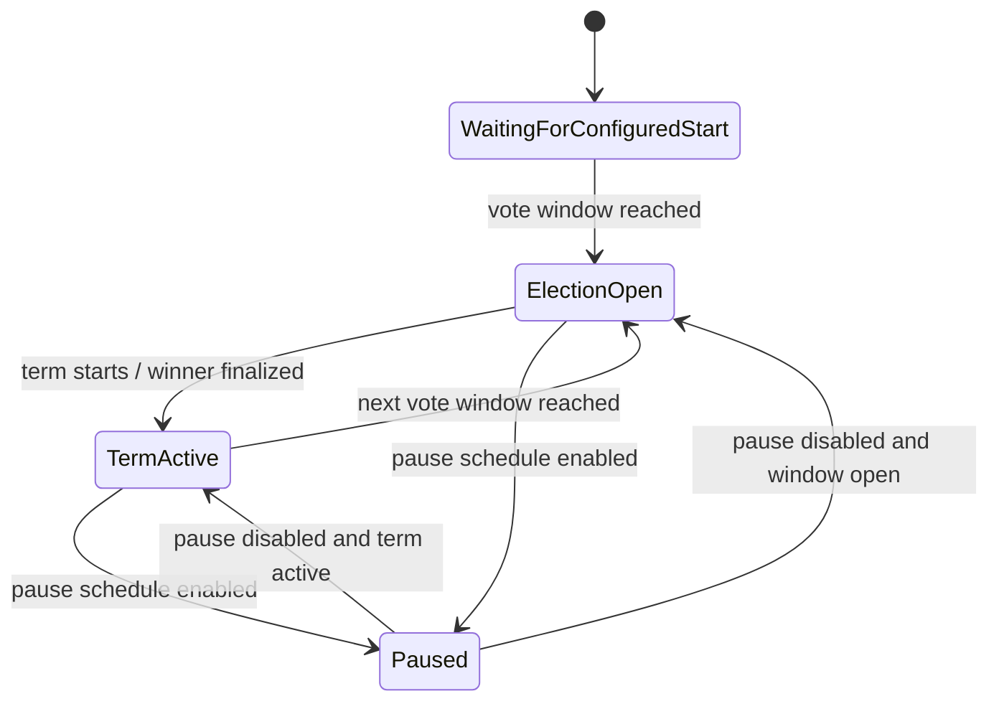

# Elections

```mermaid
flowchart TD
    Schedule["TermService tick / tickNow"]
    Timeline["domain.election.TermTimeline\nterm and vote-window calculation"]
    Policies["domain.election policies\ncandidate and vote rules"]
    Repo["ElectionRepository"]
    Store["MayorStore"]
    Candidates["Candidate applications"]
    Votes["Real votes + fake vote adjustments"]
    Winner["Winner selection"]
    Perks["PerkService\nactive perk rebuild"]
    Rewards["Display reward + LuckPerms mayor group sync"]
    Events["MayorSystem API events"]
    Displays["NPC, hologram, showcase sync"]

    Schedule --> Timeline
    Candidates --> Policies
    Votes --> Policies
    Policies --> Repo
    Repo --> Store
    Store --> Votes
    Store --> Candidates
    Schedule --> Winner
    Winner --> Store
    Winner --> Perks
    Winner --> Rewards
    Perks --> Events
    Winner --> Displays
```

```mermaid
stateDiagram-v2
    [*] --> WaitingForConfiguredStart
    WaitingForConfiguredStart --> ElectionOpen: vote window reached
    ElectionOpen --> TermActive: term starts / winner finalized
    TermActive --> ElectionOpen: next vote window reached
    TermActive --> Paused: pause schedule enabled
    ElectionOpen --> Paused: pause schedule enabled
    Paused --> ElectionOpen: pause disabled and window open
    Paused --> TermActive: pause disabled and term active
```
