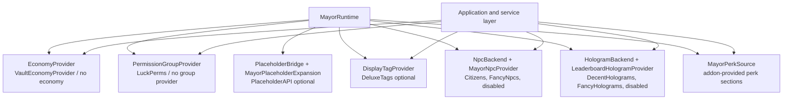

# Integrations

Optional integrations remain optional. Missing plugins should route to disabled/no-op behavior instead of making MayorSystem fail unless the configured data store itself cannot load. Addons inject perk sections through the public MayorSystem API.
