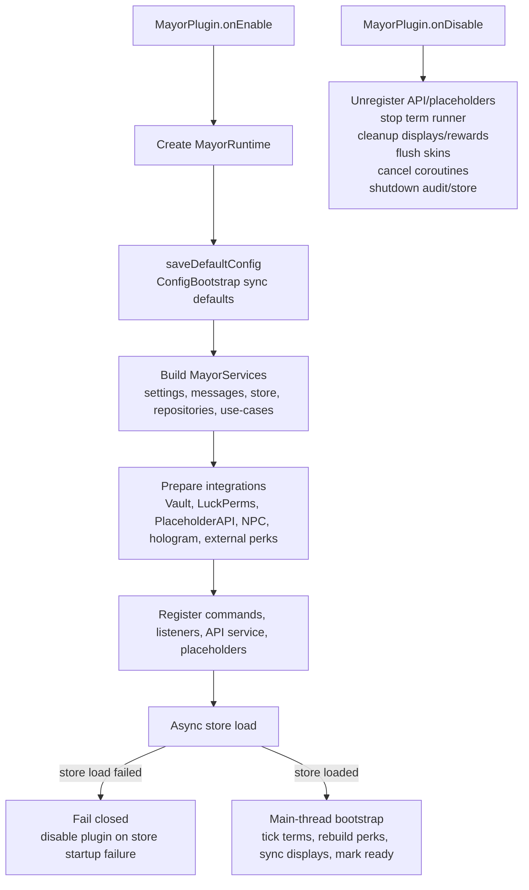
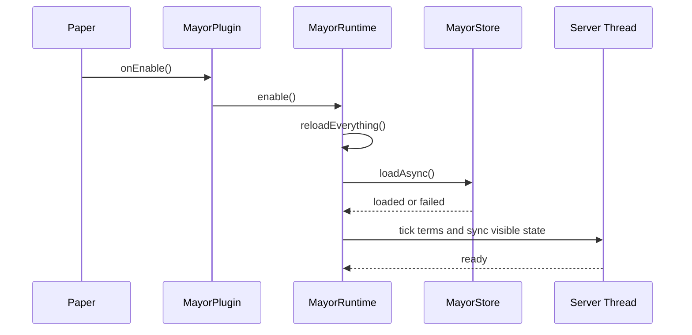

# Lifecycle

```mermaid
flowchart TD
    Enable["MayorPlugin.onEnable"]
    Runtime["Create MayorRuntime"]
    Defaults["saveDefaultConfig\nConfigBootstrap sync defaults"]
    Services["Build MayorServices\nsettings, messages, store, repositories, use-cases"]
    Integrations["Prepare integrations\nVault, LuckPerms, PlaceholderAPI, NPC, hologram, external perks"]
    Register["Register commands, listeners, API service, placeholders"]
    Bootstrap["Async store load"]
    Fail["Fail closed\ndisable plugin on store startup failure"]
    Ready["Main-thread bootstrap\ntick terms, rebuild perks, sync displays, mark ready"]
    Disable["MayorPlugin.onDisable"]
    Shutdown["Unregister API/placeholders\nstop term runner\ncleanup displays/rewards\nflush skins\ncancel coroutines\nshutdown audit/store"]

    Enable --> Runtime --> Defaults --> Services --> Integrations --> Register --> Bootstrap
    Bootstrap -->|store load failed| Fail
    Bootstrap -->|store loaded| Ready
    Disable --> Shutdown
```

```mermaid
sequenceDiagram
    participant Paper
    participant Plugin as MayorPlugin
    participant Runtime as MayorRuntime
    participant Store as MayorStore
    participant Main as Server Thread

    Paper->>Plugin: onEnable()
    Plugin->>Runtime: enable()
    Runtime->>Runtime: reloadEverything()
    Runtime->>Store: loadAsync()
    Store-->>Runtime: loaded or failed
    Runtime->>Main: tick terms and sync visible state
    Main-->>Runtime: ready
```
