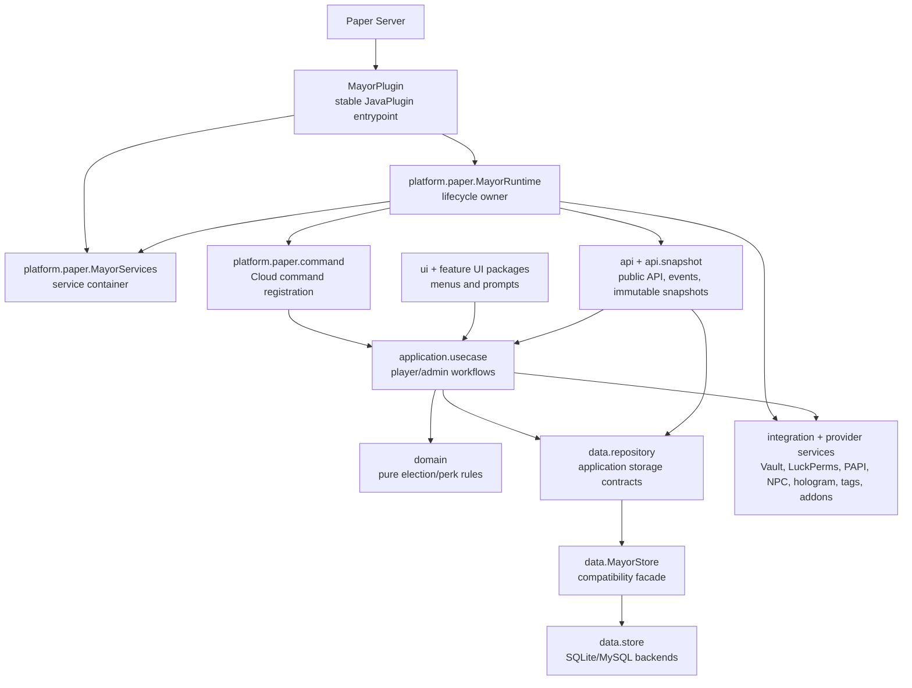

# Main Architecture

```mermaid
flowchart TB
    Server["Paper Server"]
    Plugin["MayorPlugin\nstable JavaPlugin entrypoint"]
    Runtime["platform.paper.MayorRuntime\nlifecycle owner"]
    Services["platform.paper.MayorServices\nservice container"]
    Commands["platform.paper.command\nCloud command registration"]
    UI["ui + feature UI packages\nmenus and prompts"]
    App["application.usecase\nplayer/admin workflows"]
    Domain["domain\npure election/perk rules"]
    Data["data.repository\napplication storage contracts"]
    Store["data.MayorStore\ncompatibility facade"]
    SQL["data.store\nSQLite/MySQL backends"]
    Integrations["integration + provider services\nVault, LuckPerms, PAPI, NPC, hologram, tags, addons"]
    API["api + api.snapshot\npublic API, events, immutable snapshots"]

    Server --> Plugin
    Plugin --> Runtime
    Plugin --> Services
    Runtime --> Services
    Runtime --> Commands
    Runtime --> Integrations
    Runtime --> API
    Commands --> App
    UI --> App
    App --> Domain
    App --> Data
    App --> Integrations
    Data --> Store
    Store --> SQL
    API --> App
    API --> Data
```
