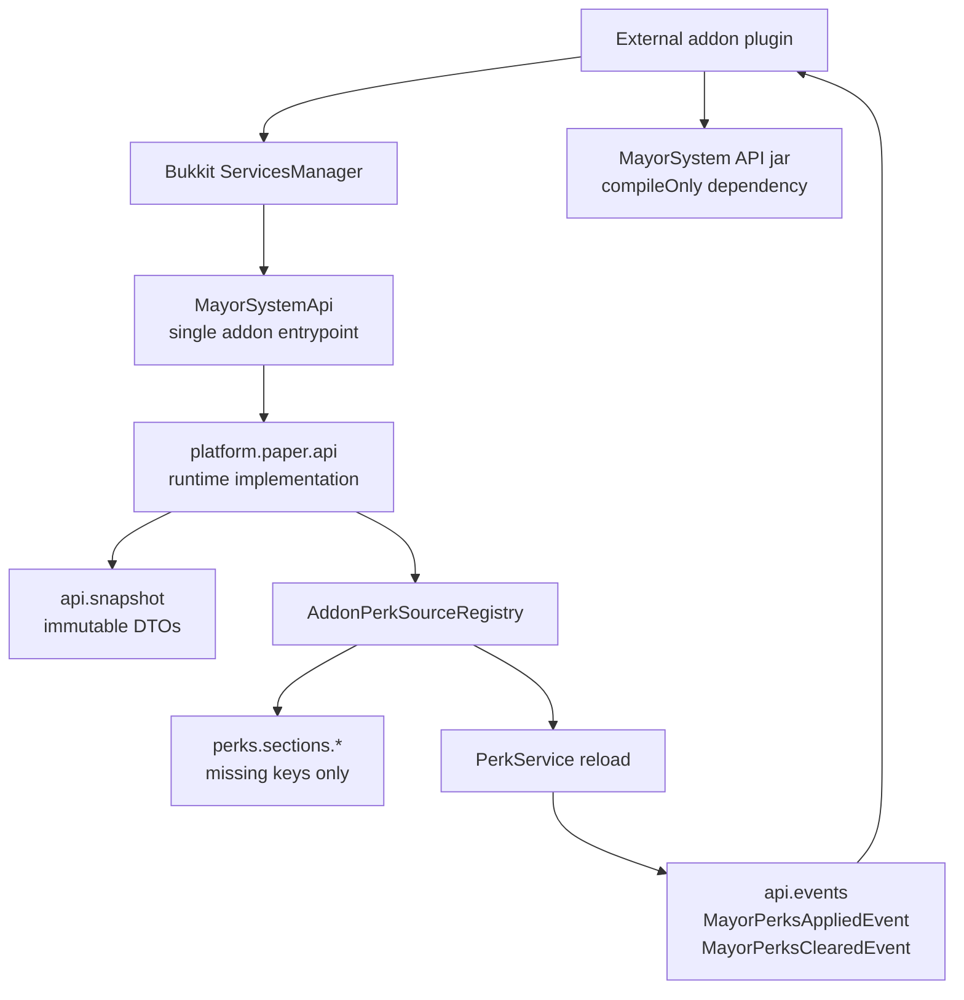

# Public API

Addons compile against the API jar and load the live runtime API through Bukkit services. Public access is limited to snapshots, events, active/all perk ids, and addon perk-source registration.
