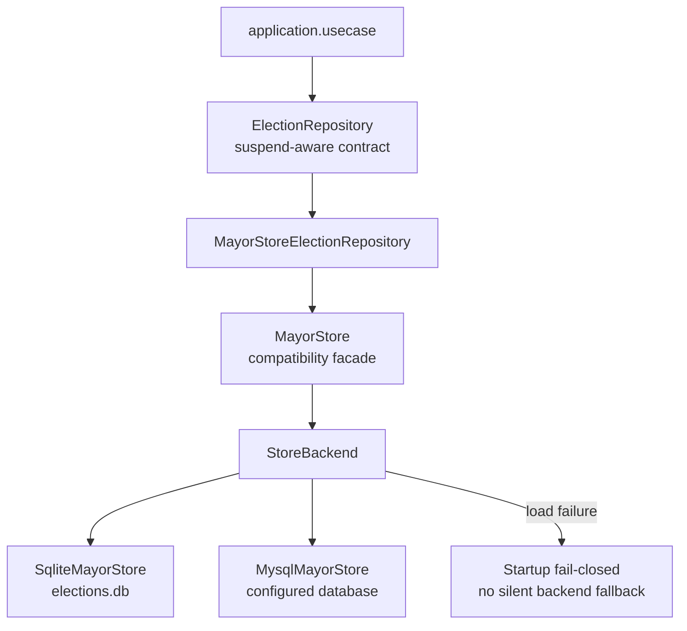
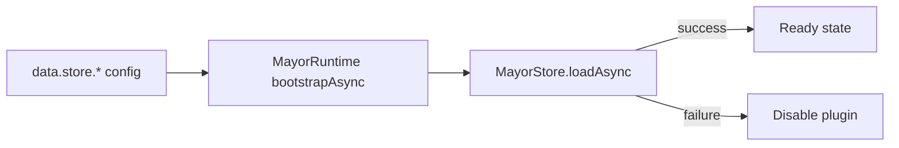

# Storage

```mermaid
flowchart TD
    App["application.usecase"]
    Repo["ElectionRepository\nsuspend-aware contract"]
    Adapter["MayorStoreElectionRepository"]
    Store["MayorStore\ncompatibility facade"]
    Backend["StoreBackend"]
    SQLite["SqliteMayorStore\nelections.db"]
    MySQL["MysqlMayorStore\nconfigured database"]
    FailClosed["Startup fail-closed\nno silent backend fallback"]

    App --> Repo
    Repo --> Adapter
    Adapter --> Store
    Store --> Backend
    Backend --> SQLite
    Backend --> MySQL
    Backend -->|load failure| FailClosed
```

```mermaid
flowchart LR
    Config["data.store.* config"]
    Startup["MayorRuntime bootstrapAsync"]
    Load["MayorStore.loadAsync"]
    Ok["Ready state"]
    Bad["Disable plugin"]

    Config --> Startup --> Load
    Load -->|success| Ok
    Load -->|failure| Bad
```
